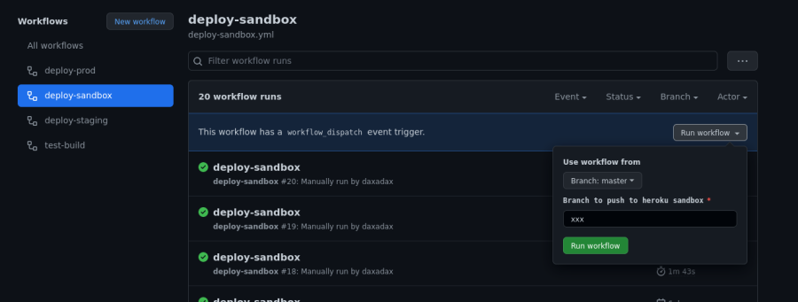

#### How to use Heroku & Github actions for Decentraland scene & server


This is a short tutorial, how to set up fast CD of your scene & server to Heroku (if you have both of them in one repository)


**1.** First, we must have the scene and server we will deploy in the test environment.
Make sure you can start it in the local environment without any issues.
Create a root directory with two folders - scene and server.


**2.** Init a git repository.
Connect your local repo with the remote one. Push the changes.

**3.** Create two new Heroku apps. One for the scene and one for the server.
Let’s name it (we will need them later) :
- test-heroku-deploy-scene
- test-heroku-deploy-server


**4.** Go to the setting page of each app and add two build-packs:

- https://github.com/timanovsky/subdir-heroku-buildpack (for deploying from subdirectories)
- heroku/nodejs


**5.** On the same page, you must set a global variable with the name PROJECT_PATH for the scene & the server folders.
For both apps.


You may add any necessary variables. e.g. if you use a DB (as on pic above)


**6.** Next, you have to go to Heroku general settings and create a new API KEY.


**7.** Add variables to the GitHub settings of the repo.
```
https://github.com/<your_github_name>/<name_of _repo>/settings/secrets/actions
```

```
HEROKU_API_KEY = the API Key from the previous step
HEROKU_EMAIL = email of your account on Heroku
```


**8.** At the root of the project, create folder .github/workflows/decentraland.yml


```
name: Decentraland CI / CD

on:
 push:
   branches: ["heroku"]

jobs:
 build:
   runs-on: ubuntu-latest

   strategy:
     matrix:
       node-version: [16.x]

   steps:
     - uses: actions/checkout@v3
     - name: Deploy server
       uses: akhileshns/heroku-deploy@v3.12.12
       with:
         heroku_api_key: ${{secrets.HEROKU_API_KEY}}
         heroku_app_name: "test-heroku-deploy-server" //name of the server app
         heroku_email: ${{secrets.HEROKU_EMAIL}}

     - name: Deploy scene
       uses: akhileshns/heroku-deploy@v3.12.12
       with:
         heroku_api_key: ${{secrets.HEROKU_API_KEY}}
         heroku_app_name: "test-heroku-deploy-scene" //name of the scene app
         heroku_email: ${{secrets.HEROKU_EMAIL}}


```

Push changes to the remote repo.


**9.** As the endpoint for the server on the scene, use:

```
const realm = await getCurrentRealm()

    if (realm?.displayName == "test-heroku-deploy-scene.herokuapp.com") {
        ENDPOINT = "wss://test-heroku-deploy-server.herokuapp.com"

    }

```

**10.** Create and checkout to the new branch with the name “heroku” and push it to the remote repo.

Any time you push to the heroku branch, it will trigger automation deployment to Heroku.
You can see the progress of the deployment on:
```
https://github.com/<your_github_name>/<name_of _repo>/actions
```


After successful deployment, the scene will be available on:

```
https://test-heroku-deploy-scene.herokuapp.com/?realm=v1~test-heroku-deploy-scene.herokuapp.com&ENABLE_WEB3=&position=<position_of_your_scene>
```

#### Another deployment option

If you'd like to deploy to Heroku manually, you can use the following approach where you specify a branch for the workflow to push rather than push your code to a specific branch.

This is particularly useful if not all members of your team are comfortable using git from the commandline.

```
name: deploy-sandbox

on:
  workflow_dispatch:
    inputs:
      branch:
        description: 'Branch to push to heroku sandbox'
        required: true

jobs:
  deploy:
    runs-on: ubuntu-latest

    strategy:
      matrix:
        node-version: [16.x]

    steps:
      - uses: actions/checkout@v3
        with:
          ref: ${{ inputs.branch }}

      - name: Deploy scene
        uses: akhileshns/heroku-deploy@v3.12.12
        with:
          heroku_api_key: ${{secrets.HEROKU_API_KEY}}
          heroku_app_name: "test-heroku-deploy-scene" //name of the scene app
          heroku_email: ${{secrets.HEROKU_EMAIL}}
          branch: ${{ inputs.branch }}
```

Branches can be deployed to the heroku sandbox by clicking the Actions menu in the navbar, followed by the deploy-sandbox workflow in the left sidebar. From there, click Run workflow in the bar that comes up in the main content section and enter the name of the branch you'd like to push to heroku in the indicated field.


